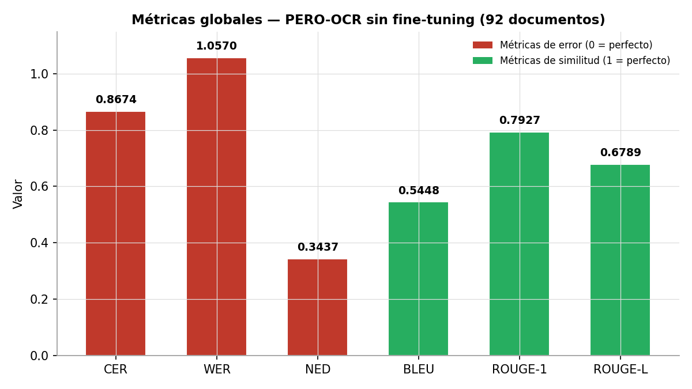
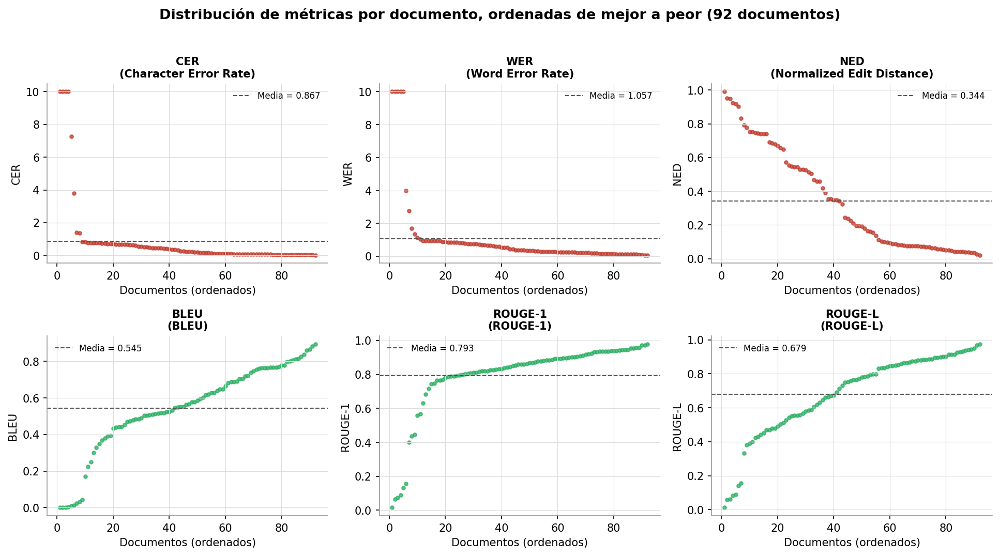
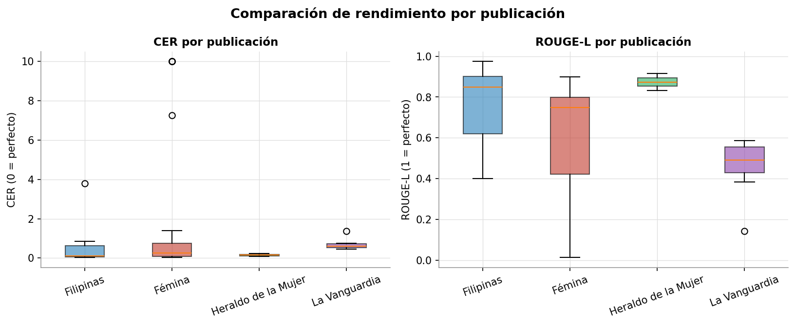

# Evaluación de PERO-OCR sin fine-tuning

Este directorio contiene los resultados de la evaluación del modelo base de PERO-OCR (modelo `OCR_350000.pt`, sin ningún entrenamiento adicional) sobre el corpus de pruebas del repositorio (92 páginas de prensa histórica en español procedentes de Filipinas, República Dominicana y Puerto Rico).

## Metodología

Para cada una de las 92 páginas se ha comparado la transcripción automática generada por PERO-OCR con la transcripción manual (ground truth) extraída de los PAGE-XML de Transkribus. El cálculo de las métricas se ha realizado con el framework *From Paper to Pixel* desarrollado por Jaione Macicior-Mitxelena y Ana García-Serrano (https://github.com/jaionemacicior/from-paper-to-pixel), siguiendo el mismo enfoque metodológico empleado por el equipo GRESEL en su participación en la tarea compartida *PastReader: Transcribing Texts from the Past* (IberLEF 2025).

Se han calculado seis métricas complementarias, agrupadas en dos familias:

**Métricas de error a nivel de carácter y palabra** (cuanto más bajas, mejor; 0 = transcripción idéntica al ground truth):

- **CER** (Character Error Rate): proporción de caracteres que habría que insertar, eliminar o sustituir para convertir la transcripción de PERO-OCR en el texto de referencia.
- **WER** (Word Error Rate): la misma idea que el CER pero a nivel de palabra completa.
- **NED** (Normalized Edit Distance): distancia de edición de Levenshtein normalizada por la longitud del texto, otra medida de fidelidad literal.

**Métricas de similitud semántica y léxica** (cuanto más altas, mejor; 1 = coincidencia perfecta):

- **BLEU**: mide el solapamiento de n-gramas entre la transcripción y la referencia, capturando si las secuencias de palabras se preservan.
- **ROUGE-1**: mide la coincidencia de vocabulario (unigramas) entre ambos textos, es decir, qué proporción de palabras de la referencia aparecen también en la transcripción.
- **ROUGE-L**: mide la coincidencia de subsecuencias comunes más largas, capturando la coherencia global del orden del texto.

Esta combinación de métricas ofrece una visión completa del rendimiento: las métricas de error a nivel de carácter penalizan cualquier desviación literal del texto, mientras que BLEU y ROUGE valoran si el contenido y el significado se preservan aunque existan pequeñas diferencias de transcripción.

## Resultados globales (92 documentos)

| Métrica | Valor | Referencia | Interpretación |
|---|---|---|---|
| CER | 0.8674 | 0 = perfecto | Error medio por carácter |
| WER | 1.0570 | 0 = perfecto | Error medio por palabra |
| NED | 0.3437 | 0 = perfecto | Distancia de edición normalizada |
| BLEU | 0.5448 | 1 = perfecto | Similitud de secuencias de palabras |
| ROUGE-1 | 0.7927 | 1 = perfecto | Coincidencia de vocabulario |
| ROUGE-L | 0.6789 | 1 = perfecto | Coincidencia de secuencias largas |

Los valores de CER y WER superiores a 1 indican que, para los documentos peor transcritos, PERO-OCR genera más caracteres o palabras de las que contiene el texto de referencia (por ejemplo, cuando el ground truth está anotado de forma parcial en Transkribus pero PERO-OCR transcribe la página completa). Sin embargo, las métricas semánticas (BLEU, ROUGE-1, ROUGE-L) muestran que, en conjunto, la mayoría de los documentos conservan un alto grado de fidelidad de contenido respecto al texto de referencia, incluso sin ningún fine-tuning del modelo.

## Distribución por documento

La siguiente figura muestra, para cada métrica, los 92 documentos ordenados de mejor a peor resultado. La línea discontinua marca la media global. Se observa un patrón consistente en las seis métricas: la gran mayoría de los documentos se agrupan en valores muy favorables, mientras que un pequeño número de páginas (entre 3 y 10, según la métrica) concentra los peores resultados y desplaza notablemente la media.

## Comparación por publicación

El corpus de pruebas incluye páginas de cuatro publicaciones distintas. La siguiente figura compara su rendimiento en CER y ROUGE-L:

| Publicación | Nº páginas | CER medio | WER medio | NED medio | BLEU medio | ROUGE-1 medio | ROUGE-L medio |
|---|---|---|---|---|---|---|---|
| Filipinas (1909-1910) | 49 | 0.3485 | 0.4905 | 0.2633 | 0.6147 | 0.8617 | 0.7683 |
| Fémina (1922-1923) | 31 | 1.7969 | 2.0661 | 0.4015 | 0.4554 | 0.6852 | 0.5947 |
| Heraldo de la Mujer (1919) | 2 | 0.1535 | 0.2445 | 0.1424 | 0.7085 | 0.9182 | 0.8733 |
| La Vanguardia (1944) | 10 | 0.6718 | 0.8673 | 0.5982 | 0.4463 | 0.7628 | 0.4626 |

Las páginas de **Filipinas (1909-1910)** y **Heraldo de la Mujer (1919)** obtienen sistemáticamente los mejores resultados, con layouts más simples y buena calidad de escaneo. Las páginas de **Fémina** presentan la mayor dispersión: la mayoría de los documentos obtienen muy buenos resultados (CER por debajo de 0.1), pero unas pocas páginas concentran los peores valores del corpus, lo que eleva considerablemente la media del grupo. **La Vanguardia (1944)**, con su layout a varias columnas y mayor densidad de texto por página, obtiene resultados intermedios.

## Documentos mejor y peor transcritos

### Top 5 mejores (menor CER)

| Documento | CER | Observación |
|---|---|---|
| Filipinas-30-Abril-1909-P18 | 0.0217 | Layout simple, buen escaneo |
| Filipinas-22-Abril-1909-P03 | 0.0284 | Layout simple, buen escaneo |
| Filipinas_1909_nov_15_page37 | 0.0356 | Muy buen resultado |
| Filipinas-30-Abril-1909-P17 | 0.0376 | Muy buen resultado |
| Fémina-15-07-1922_p009 | 0.0393 | BLEU = 0.77, ROUGE-L = 0.90 |

### Top 5 peores (mayor CER)

| Documento | CER | Causa probable |
|---|---|---|
| Fémina-10-01-1923_p004 | 7.2576 | Ground truth muy corto (66 caracteres) — anotación parcial en Transkribus |
| Femina-31-08-1922_p007 | 10.0000 | Ground truth muy corto (97 caracteres) frente a 1108 transcritos |
| Fémina-10-01-1923_p011 | 10.0000 | Ground truth muy corto (28 caracteres) — anotación parcial |
| Fémina-15-07-1922_p008 | 10.0000 | Ground truth muy corto (38 caracteres) frente a 3609 transcritos |
| Fémina-15-10-1922_p004 | 10.0000 | Layout complejo, ground truth parcial (114 caracteres) |

En todos los casos del top 5 peor, el patrón es el mismo: el texto anotado como ground truth en Transkribus es mucho más corto que el texto real de la página, por lo que PERO-OCR "penaliza" al transcribir contenido adicional que sí está presente en la imagen pero no en la anotación de referencia. Esto sugiere que estas páginas tienen una anotación parcial en Transkribus más que un fallo real del modelo de OCR.

## Archivos de este directorio

| Archivo | Contenido |
|---|---|
| `metricas_globales.json` | Métricas globales agregadas de los 92 documentos |
| `resultados_por_documento.json` | Métricas individuales (CER, WER, NED, BLEU, ROUGE-1, ROUGE-L) para cada uno de los 92 documentos |
| `resumen_por_publicacion.json` | Métricas medias agregadas por publicación |
| `ground_truth/` | Textos de referencia extraídos de los PAGE-XML de Transkribus |
| `metricas_globales.png` | Gráfico de barras con las métricas globales |
| `metricas_por_documento.png` | Distribución de cada métrica ordenada de mejor a peor por documento |
| `metricas_por_publicacion.png` | Comparación de CER y ROUGE-L por publicación |

## Referencias

Macicior-Mitxelena, J. y García-Serrano, A. (2026). *From Paper to Pixel: Experimental Framework for Access to Historical Spanish Documents*. https://github.com/jaionemacicior/from-paper-to-pixel

García-Serrano, A., Torterolo Orta, Y. A. et al. (2025). *GRESEL teams at PastReader: Transcribing Texts from the Past*. IberLEF 2025. https://arxiv.org/abs/2507.04878

Hradiš, M., Kodym, O., y Kohút, J. (2026). *PERO OCR: Automatic document processing*. Brno University of Technology. https://github.com/DCGM/pero-ocr
